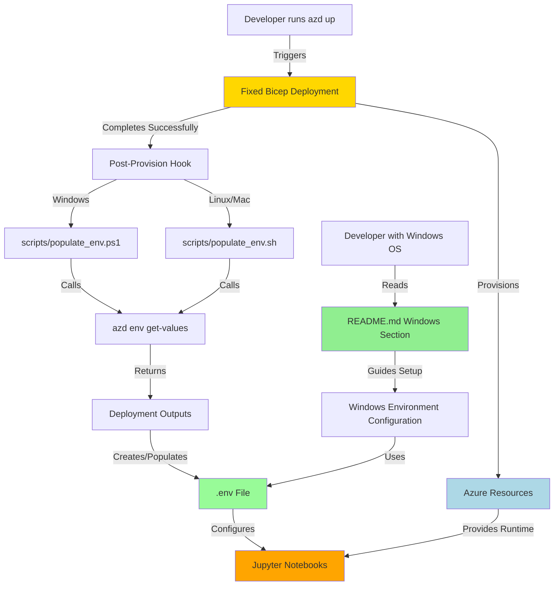

# Azure AI Foundry Agents - Brownfield Enhancement Architecture

## Introduction

This document outlines the architectural approach for enhancing the **Azure AI Foundry Agents** educational repository with **Windows developer support** and **Bicep infrastructure fixes and deployment automation enhancements**. Its primary goal is to serve as the guiding architectural blueprint for AI-driven development of these enhancements while ensuring seamless integration with the existing system.

**Relationship to Existing Architecture:**
This document supplements the existing project structure by defining how new documentation and infrastructure enhancements will integrate while making minimal, targeted fixes to existing Bicep infrastructure to improve reliability and automation. Python code and notebooks remain completely unchanged.

### Existing Project Analysis

#### Current Project State

- **Primary Purpose**: Educational Python repository demonstrating the evolution of AI agents from basic LLMs to multi-agent orchestration systems through 7 progressive Jupyter notebooks
- **Current Tech Stack**: Python 3.11+, Azure AI Foundry SDK, Semantic Kernel, MCP, Jupyter, Azure Logic Apps
- **Architecture Style**: Educational monorepo with notebook-based demonstrations and supporting Python modules
- **Deployment Method**: Bicep Infrastructure as Code deploying to Azure via Azure Developer CLI (`azd`)

#### Available Documentation

- README.md with project overview and Linux/Mac setup instructions
- pyproject.toml defining Python dependencies and project metadata
- .env.example showing required environment variables
- Bicep infrastructure modules in `/infra` directory
- Setup scripts: `setup_local.sh` (bash) and minimal `setup_local.ps1` (PowerShell)

#### Identified Constraints

- **Educational Focus**: All enhancements must maintain the project's educational clarity and simplicity
- **No Breaking Changes to Code**: Existing Python code and notebooks must remain completely untouched
- **Multi-Platform Support**: Project must work seamlessly on Linux, Mac, and Windows
- **Infrastructure Automation**: Deployment should require minimal manual configuration steps
- **Azure Subscription Required**: Project requires Azure resources; local-only execution not supported for notebooks 5-7

### Change Log

| Change | Date | Version | Description | Author |
|--------|------|---------|-------------|--------|
| Initial Architecture | 2025-11-04 | 1.0 | Created brownfield enhancement architecture for Windows + Bicep automation | Architect Winston |
| Scope Correction | 2025-11-05 | 1.1 | Corrected Story 1.2 from Terraform to Bicep infrastructure fixes/automation | PM John |

---

## Enhancement Scope and Integration Strategy

### Enhancement Overview

- **Enhancement Type**: Developer Experience Enhancement (Documentation + Infrastructure Fixes/Automation)
- **Scope**: (1) Windows setup documentation, (2) Bicep infrastructure fixes and deployment automation enhancement
- **Integration Impact**: Minimal - documentation additions, targeted Bicep fixes, automation scripts added, zero Python code changes

### Integration Approach

#### Code Integration Strategy

**No Python Code Changes**: This enhancement requires zero modifications to existing `.py` files, `.ipynb` notebooks, or Python modules. All integration is through documentation, infrastructure fixes, and automation scripts.

**File Changes**:
- README.md: Append new Windows setup section
- `/infra/` directory: Targeted fixes to Bicep modules for reliability and completeness
- `azure.yaml`: Enhanced with post-provision hooks for automated .env population
- `/scripts/` directory: New cross-platform automation scripts added (populate_env.sh, populate_env.ps1)
- Notebooks and Python source files remain completely unchanged

#### Database Integration

**Not Applicable**: This enhancement does not involve database changes. The project uses DuckDB for local demos (notebook 6-mcp-pg.ipynb) which remains unchanged.

#### API Integration

**Not Applicable**: This enhancement does not add or modify APIs. Existing Azure AI Foundry API usage, Logic Apps API connections, and OpenAPI tool integrations remain unchanged.

#### UI Integration

**Not Applicable**: This is a notebook-based project with no traditional UI. Jupyter notebook interfaces remain unchanged.

### Compatibility Requirements

- **Existing API Compatibility**: N/A - no API changes
- **Database Schema Compatibility**: N/A - no database changes
- **UI/UX Consistency**: Documentation style matches existing README formatting
- **Performance Impact**: Zero performance impact on notebook execution; enhanced automation reduces manual setup time significantly

---

## Tech Stack

### Existing Technology Stack

| Category | Current Technology | Version | Usage in Enhancement | Notes |
|----------|-------------------|---------|----------------------|-------|
| **Languages** |
| Python | Python | >= 3.11 | No changes | Core language for notebooks |
| Bash/PowerShell | Shell scripting | >= 5.1 (PS), bash | New automation scripts | Cross-platform .env automation |
| **Package Management** |
| uv | uv | latest | Documented for Windows | Modern Python package manager |
| **Frameworks** |
| Azure AI Agents SDK | azure-ai-agents | >= 1.2.0b1 | No changes | Agent creation framework |
| Semantic Kernel | semantic-kernel | >= 1.35.2 | No changes | LLM orchestration |
| Jupyter | ipykernel | >= 6.30.1 | No changes | Notebook environment |
| **Database** |
| DuckDB | duckdb | >= 1.0.0 | No changes | Local analytics DB (notebook 6) |
| **Infrastructure** |
| Bicep | Bicep | latest | Fixed and enhanced | Existing IaC with targeted reliability fixes |
| Azure CLI | az | latest | No changes | Bicep deployment tool |
| Azure Developer CLI | azd | latest | Enhanced with hooks | Bicep workflow orchestration + automation |
| **External Dependencies** |
| Azure AI Foundry | Azure Platform | N/A | Fixed Bicep deployment | AI agent platform |
| Azure OpenAI | Azure Platform | N/A | Fixed Bicep deployment | GPT model hosting |
| Azure Logic Apps | Azure Platform | N/A | Fixed Bicep deployment | Workflow automation |
| Office 365 APIs | Microsoft 365 | N/A | No changes | Logic App connectors |

### New Technology Additions

| Technology | Version | Purpose | Rationale | Integration Method |
|------------|---------|---------|-----------|-------------------|
| PowerShell Scripts | >= 5.1 | Cross-platform .env automation | Native Windows scripting for automated environment setup; pairs with bash scripts for Linux/Mac | New scripts in `/scripts/` directory called via azd hooks |
| Azure Developer CLI Hooks | azd latest | Post-provision automation | Enables automatic .env population after deployment without manual steps | Configuration added to `azure.yaml` |

---

## Data Models and Schema Changes

**Not Applicable**: This enhancement does not introduce new data models or modify existing schemas.

The project uses:
- **Azure AI Foundry**: Agent definitions (managed by Azure service)
- **DuckDB**: Local book database for notebook 6 demonstration (unchanged)
- **Logic Apps**: Workflow definitions (deployed via Bicep infrastructure)

No data model changes are required or included in this enhancement.

---

## Component Architecture

### New Components

#### Component 1: Windows Setup Documentation

**Responsibility**: Provide comprehensive Windows-specific setup guidance enabling Windows developers to successfully configure their environment and run all 7 notebooks.

**Integration Points**:
- README.md (existing file, new section appended)
- `.env` file creation (existing process, documented for Windows)
- Jupyter kernel selection (existing functionality, Windows path differences documented)

**Key Interfaces**:
- Markdown documentation consumed by developers
- No programmatic interfaces

**Dependencies**:
- **Existing Components**: README.md structure, existing setup process, .env.example format
- **New Components**: None (standalone documentation)

**Technology Stack**: Markdown, PowerShell code examples

---

#### Component 2: Bicep Infrastructure Fixes & Automation Enhancement

**Responsibility**: Fix broken or incomplete Bicep infrastructure modules in `/infra` directory and enhance deployment automation to enable one-command setup (`azd up`) that provisions all Azure resources and automatically configures the development environment.

**Integration Points**:
- Existing Bicep modules in `/infra/` directory (audit, fix, and enhance)
- `azure.yaml` configuration file (add post-provision automation hooks)
- `.env` file (auto-populated via new automation scripts)
- All 7 Jupyter notebooks (consumers of fixed infrastructure)
- Azure subscription (deployment target, unchanged)

**Key Interfaces**:
- `azd up` CLI command (user invocation, enhanced workflow)
- Azure Resource Manager API (Bicep deployment, unchanged)
- Post-provision hooks (new automation trigger)
- Cross-platform scripts: `scripts/populate_env.sh` and `scripts/populate_env.ps1` (new automation logic)
- `azd env get-values` output (source for .env automation)

**Dependencies**:
- **Existing Components**:
  - `/infra/main.bicep` and modules (to be fixed)
  - `azure.yaml` (to be enhanced)
  - `.env.example` (defines required variables structure)
  - Python notebooks (infrastructure consumers, unchanged)
- **New Components**:
  - `scripts/populate_env.sh` (bash automation script)
  - `scripts/populate_env.ps1` (PowerShell automation script)

**Technology Stack**: Bicep (existing IaC), Azure Developer CLI (enhanced with hooks), Bash/PowerShell scripts (new automation), Azure platform services

**Enhanced Deployment Workflow**:
```
User runs: azd up
    ↓
Azure Developer CLI orchestration:
    1. Bicep compilation (fixed modules)
    2. ARM template deployment
    3. Resource provisioning (all 7 notebook requirements)
    4. Deployment outputs captured
    ↓
Post-provision hook triggers (NEW):
    - Windows: azure.yaml → scripts/populate_env.ps1
    - Linux/Mac: azure.yaml → scripts/populate_env.sh
    ↓
Automation script execution (NEW):
    1. Calls: azd env get-values
    2. Parses: deployment outputs
    3. Creates: .env file in repository root
    4. Populates: all required environment variables
    ↓
Result: Fully configured development environment
User can immediately: uv sync → select kernel → run notebooks
```

**Bicep Module Areas Requiring Fixes**:
- `/infra/modules/networking/`: VNet configuration, subnet delegation, private DNS zones
- `/infra/modules/ai/`: AI Foundry hub, project configuration, model deployments, Bing/Playwright connections
- `/infra/modules/function/`: Logic App Standard deployment, workflow definitions, Office 365 connections
- `/infra/modules/monitor/`: Log Analytics, Application Insights integration
- `/infra/main.bicep`: Orchestration, parameter passing, output definitions

**Automation Enhancement Details**:

1. **azure.yaml Enhancement**:
   - Add `hooks.postprovision` section
   - Configure platform-specific script execution (Windows: PowerShell, POSIX: bash)
   - Ensure hooks run automatically after successful deployment

2. **populate_env.sh (bash)**:
   - Extract deployment outputs via `azd env get-values`
   - Parse output format (KEY=VALUE pairs)
   - Write to `.env` file in correct format
   - Handle errors gracefully (deployment failure, missing values)

3. **populate_env.ps1 (PowerShell)**:
   - Functional equivalent of bash script for Windows
   - Use PowerShell native commands and output handling
   - Maintain cross-platform consistency in .env format

**Success Criteria**:
- Single command (`azd up`) provisions all resources and configures environment
- All 7 notebooks run successfully after deployment (Windows, Linux, Mac)
- `.env` file automatically created and populated (no manual copying)
- Bicep deployment completes without errors in clean Azure subscription
- Infrastructure supports all notebook requirements (AI Foundry, Logic Apps, Search, etc.)

### Component Interaction Diagram



---

## API Design and Integration

**Not Applicable**: This enhancement does not add or modify APIs.

Existing API usage (Azure AI Foundry, OpenAI, Logic Apps, external weather API) remains unchanged.

---

## External API Integration

**Not Applicable**: This enhancement does not introduce new external API integrations.

Existing external APIs remain unchanged:
- **Weather API**: OpenAPI tool definition in `docs/weather.json` (unchanged)
- **Bing Search**: Azure AI Foundry Bing grounding connection (fixed in Bicep deployment)
- **Office 365**: Logic Apps API connections (fixed in Bicep deployment)
- **Playwright**: Browser automation connection (fixed in Bicep deployment)

---

## Source Tree

### Existing Project Structure

```plaintext
evolution-of-agents/
├── .env.example                 # Environment variable template
├── .python-version              # Python version specification
├── pyproject.toml               # Python project configuration
├── uv.lock                      # Python dependency lock file
├── README.md                    # Project documentation (to be enhanced)
├── setup.py                     # Azure AI agent setup utilities
├── 1-just-llm.ipynb            # Notebook 1: Basic LLM
├── 2-rag.ipynb                 # Notebook 2: RAG
├── 3-tools.ipynb               # Notebook 3: Tool calling
├── 4-better-tools.ipynb        # Notebook 4: Improved tools
├── 5-foundry-tools.ipynb       # Notebook 5: Azure Foundry tools
├── 6-mcp.ipynb                 # Notebook 6: MCP integration
├── 6-mcp-pg.ipynb              # Notebook 6 variant: MCP with Postgres
├── 7-agent.ipynb               # Notebook 7: Multi-agent orchestration
├── AzureStandardLogicAppTool.py # Logic Apps tool integration
├── books_tool.py                # Books database tool
├── books_sql.py                 # Books SQL queries
├── mcp_mslearn.py               # MCP Microsoft Learn server
├── mcp_playwright.py            # MCP Playwright server
├── docs/
│   ├── BUGBUSTER.md            # Sample document for RAG demo
│   ├── weather.json            # Weather API OpenAPI spec
│   └── book1-100k.csv          # Books dataset
├── helpers/
│   ├── AzureStandardLogicAppTool.py # Logic Apps helper (duplicate)
│   └── books_tool.py           # Books tool helper (duplicate)
├── infra/                       # Bicep infrastructure (UNCHANGED)
│   ├── main.bicep
│   ├── main.bicepparam
│   └── modules/                # Bicep modules for resources
├── scripts/
│   ├── setup_local.sh          # Bash setup script (UNCHANGED)
│   └── setup_local.ps1         # PowerShell setup script (minimal, can be referenced)
├── src/                         # Additional source (workflow definitions for Logic Apps)
│   └── workflows/
└── images/                      # Visual assets for README

```

### New File Organization

```plaintext
evolution-of-agents/
├── README.md                            # ENHANCED - Windows section added
├── azure.yaml                           # ENHANCED - Post-provision hooks added
├── docs/
│   ├── prd.md                          # NEW - This PRD
│   ├── architecture.md                 # NEW - This architecture doc
│   ├── architecture/                   # NEW - Architecture shards
│   │   ├── coding-standards.md         # NEW - Development standards
│   │   ├── tech-stack.md               # NEW - Technology details
│   │   └── source-tree.md              # NEW - Project structure guide
│   └── stories/                        # NEW - Epic and story documents
│       ├── epic-1-developer-experience-improvements.md
│       ├── story-1.1-windows-setup-instructions.md
│       └── story-1.2-bicep-infrastructure-automation.md
├── infra/                              # FIXED - Bicep modules corrected
│   ├── main.bicep                      # FIXED - Output definitions corrected
│   └── modules/                        # FIXED - Individual module fixes
│       ├── networking/                 # FIXED - VNet, subnets, delegation
│       ├── ai/                         # FIXED - AI Foundry, connections
│       ├── function/                   # FIXED - Logic Apps, workflows
│       └── monitor/                    # FIXED - Logging configuration
├── scripts/                            # ENHANCED - Automation scripts added
│   ├── setup_local.sh                  # UNCHANGED - Existing bash script
│   ├── setup_local.ps1                 # UNCHANGED - Existing PowerShell script
│   ├── populate_env.sh                 # NEW - Automated .env creation (bash)
│   └── populate_env.ps1                # NEW - Automated .env creation (PowerShell)
├── (all other existing files)          # UNCHANGED
```

### Integration Guidelines

- **File Naming**: Scripts use snake_case (populate_env.sh/ps1), all other files follow existing conventions
- **Folder Organization**: `/scripts` contains automation scripts, `/infra` contains Bicep infrastructure
- **Import/Export Patterns**: No Python import changes; automation scripts parse `azd env get-values` output for `.env` creation

---

## Infrastructure and Deployment Integration

### Existing Infrastructure

**Current Deployment State**:
- **Method**: Azure Developer CLI (`azd up`) orchestrating Bicep deployment
- **Known Issues**: Bicep modules may have errors/incompleteness, manual `.env` setup required
- **Current Process**: `azd up` → Bicep compilation → ARM deployment → Resource provisioning → Manual `.env` creation
- **Manual Step**: User must run `azd env get-values` and manually copy to `.env` file

**Infrastructure Tools**:
- Bicep (IaC language)
- Azure CLI (Bicep deployment)
- Azure Developer CLI (workflow orchestration)

**Environments**:
- Single environment model (dev/prod determined by user's Azure subscription and resource group choice)
- Resource naming uses unique token based on resource group ID

### Enhancement Deployment Strategy

**Enhanced Deployment Approach (Bicep with Automation)**:

**Phase 1: Bicep Infrastructure Fixes**
1. Audit all Bicep modules in `/infra/modules/` for errors and incompleteness
2. Fix identified issues (resource configurations, dependencies, outputs)
3. Validate fixes with `az bicep build` and test deployment
4. Ensure all 7 notebooks' infrastructure requirements are met

**Phase 2: Automation Enhancement**
1. Add post-provision hooks to `azure.yaml`:
   - Windows: Execute `scripts/populate_env.ps1`
   - Linux/Mac: Execute `scripts/populate_env.sh`
2. Create automation scripts:
   - `populate_env.sh`: Bash script calling `azd env get-values` and creating `.env`
   - `populate_env.ps1`: PowerShell equivalent for Windows
3. Test automation on all platforms (Windows 11, Linux, macOS)

**Enhanced User Workflow**:
1. User authenticates: `azd auth login`
2. User deploys: `azd up`
3. **AUTOMATIC**: Post-provision hook runs platform-appropriate script
4. **AUTOMATIC**: Script creates `.env` file with all required variables
5. User completes setup: `uv sync` → select Jupyter kernel → run notebooks

**Infrastructure Changes**:
- **Bicep Modules**: Targeted fixes for reliability and completeness
- **azure.yaml**: Enhanced with post-provision automation hooks
- **Scripts**: New automation scripts for cross-platform .env creation
- **Python Code**: Zero changes (notebooks and source unchanged)

**Pipeline Integration**:
- No CI/CD pipelines currently exist in this repository
- Future pipeline integration would use enhanced `azd up` workflow with automation

### Rollback Strategy

**Rollback Method**:
- **Bicep**: `azd down` destroys all resources
- Clean rollback possible (Azure resources are stateless for this educational project)
- Automation scripts are non-destructive (only create `.env`, don't modify existing files)

**Risk Mitigation**:
- Resources deployed to user-specified resource group (isolation from other Azure resources)
- No data persistence requirements (educational project, notebooks can be re-run)
- Clear documentation warns users about Azure costs and resource cleanup
- Bicep fixes are backward-compatible with existing deployments where possible

**Monitoring**:
- Application Insights and Log Analytics deployed by fixed Bicep modules
- Notebook telemetry configuration unchanged (Semantic Kernel OTEL diagnostics)

---

## Coding Standards

### Existing Standards Compliance

**Code Style**:
- Python: Black formatter (defined in pyproject.toml as dev dependency)
- Python: PEP 8 compliance via Black
- Markdown: GitHub-flavored markdown for README and documentation

**Linting Rules**:
- Black for Python formatting (auto-formatting, zero-config)
- No explicit linter configuration (Black handles formatting, educational project doesn't require strict linting)

**Testing Patterns**:
- No automated test suite (educational demonstration project)
- Testing is manual: Run notebooks end-to-end and verify outputs

**Documentation Style**:
- README: Markdown with visual tables, images, and step-by-step instructions
- Docstrings: Google-style Python docstrings where present
- Comments: Inline comments explaining complex Azure service configurations

### Enhancement-Specific Standards

**Bicep Fix Standards**:
- **Validation**: All Bicep fixes must pass `az bicep build` without errors
- **Linting**: Run Bicep linter and address warnings
- **Naming**: Follow existing Bicep naming conventions in the project
- **Comments**: Document why fixes were needed and what was changed
- **Testing**: Test each fix in isolation before integration
- **Backwards Compatibility**: Ensure fixes don't break existing deployments where possible

**Automation Script Standards**:
- **Error Handling**: Scripts must handle errors gracefully (missing azd, deployment failures)
- **Output Messaging**: Clear user feedback during execution
- **Cross-Platform Consistency**: Bash and PowerShell scripts produce identical `.env` output
- **Idempotency**: Scripts can be run multiple times safely (overwrite `.env` cleanly)
- **Testing**: Test scripts on all target platforms (Windows 11, Ubuntu, macOS)
- **Comments**: Explain each step for maintainability

**Windows Documentation Standards**:
- **Parity**: Windows instructions must achieve functional parity with Linux/Mac instructions
- **Clarity**: Assume PowerShell beginner knowledge; provide explanations for non-obvious commands
- **Testing**: All Windows commands must be tested on Windows 10 and Windows 11
- **Formatting**: Code blocks use PowerShell syntax highlighting

### Critical Integration Rules

- **Existing API Compatibility**: N/A (no API changes)
- **Database Integration**: N/A (no database changes)
- **Error Handling**: Automation scripts must handle failures gracefully; Windows docs include troubleshooting section for common errors
- **Logging Consistency**: Fixed Bicep modules maintain existing Log Analytics and Application Insights configuration
- **Zero Python Changes**: Absolutely no modifications to `.py` or `.ipynb` files allowed

---

## Testing Strategy

### Integration with Existing Tests

**Existing Test Framework**: None (manual testing via notebook execution)

**Test Organization**: Manual verification that notebooks run without errors

**Coverage Requirements**: Informal expectation that all 7 notebooks should run successfully

### New Testing Requirements

#### Unit Tests for New Components

**Not Applicable**: This enhancement adds documentation and infrastructure configuration, which are not unit-testable in traditional sense.

**Verification Method**: Functional testing (see Integration Tests below)

#### Integration Tests

**Scope**:
- **Windows Setup**: Test all Windows setup commands on clean Windows 10 and Windows 11 machines
- **Bicep Deployment Fixes**: Deploy fixed infrastructure via `azd up` in test Azure subscription
- **Automation Testing**: Verify automated `.env` creation works on all platforms
- **End-to-End**: Run all 7 notebooks after enhanced deployment to verify infrastructure completeness

**Existing System Verification**:
- Verify Bicep deployment improvements don't break existing deployments
- Verify Linux/Mac setup continues to work (no regression in README)
- Verify all 7 notebooks run on Linux/Mac after infrastructure fixes

**New Feature Testing**:
- Verify Windows setup instructions successfully configure environment
- Verify all 7 notebooks run on Windows using Windows setup instructions
- Verify fixed Bicep deployment provisions all required resources without errors
- Verify automated `.env` creation works on Windows 11 (PowerShell script)
- Verify automated `.env` creation works on Linux (bash script)
- Verify automated `.env` creation works on macOS (bash script)
- Verify `.env` file has correct format and all required variables
- Verify all 7 notebooks run after automated setup (no manual configuration needed)

#### Regression Testing

**Existing Feature Verification**:
- All 7 notebooks run successfully on Linux after Bicep fixes
- All 7 notebooks run successfully on Mac after Bicep fixes
- Enhanced Bicep deployment works in clean subscriptions
- Existing `setup_local.sh` still works (not replaced, supplemented)

**Automated Regression Suite**: None (manual testing)

**Manual Testing Requirements**:
1. **Baseline Test**: Deploy via enhanced `azd up`, verify automatic `.env` creation on Linux/Mac
2. **Windows Test**: Deploy via enhanced `azd up` on Windows, verify automatic `.env` creation
3. **Notebook Test**: Run all 7 notebooks end-to-end on each platform (Windows 11, Ubuntu, macOS)
4. **Clean Deployment Test**: Test in clean Azure subscription to verify no hidden dependencies
5. **Automation Idempotency Test**: Run `azd up` twice, verify `.env` correctly regenerated

---

## Security Integration

### Existing Security Measures

**Authentication**:
- Azure authentication via Azure Identity DefaultAzureCredential or AzureDeveloperCliCredential
- Supports managed identity, Azure CLI, VS Code Azure extension, environment variables
- No hardcoded credentials (all via `.env` or Azure authentication)

**Authorization**:
- Azure RBAC required: "AI User" role on AI Foundry Project for user executing notebooks
- Logic Apps API connections require user to authenticate to Office 365 (OAuth)

**Data Protection**:
- `.env` file excluded via `.gitignore` (no secrets committed)
- `.env.example` contains only placeholder values, no real credentials

**Security Tools**:
- Azure AI Foundry built-in security controls (network isolation, managed identity)
- No additional security scanning tools (educational project)

### Enhancement Security Requirements

**New Security Measures**:
- Automation script security: Scripts only read from azd outputs, don't expose credentials in logs
- Windows PowerShell execution policy: Documentation includes guidance on safely enabling script execution for setup
- `.env` file handling: Scripts create `.env` with appropriate permissions (user-readable only where supported)

**Integration Points**:
- Automation scripts use same Azure authentication as existing deployment (azd)
- Windows setup maintains same credential handling patterns (`.env` file, no hardcoded secrets)
- Bicep fixes maintain existing security configurations (managed identity, RBAC, network isolation)

**Compliance Requirements**:
- No new compliance requirements
- Educational project does not handle sensitive data
- Users responsible for their own Azure subscription compliance

### Security Testing

**Existing Security Tests**: None (manual review)

**New Security Test Requirements**:
- Verify `.gitignore` excludes `.env` file (existing, maintained)
- Verify automation scripts don't log sensitive values
- Verify automation scripts handle `azd env get-values` output securely
- Review Windows PowerShell commands for security best practices
- Verify Bicep fixes don't introduce security regressions (e.g., public endpoints, weak authentication)

**Penetration Testing**: Not applicable for educational project with no public endpoints

---

## Architecture Validation Summary

This architecture document has been designed to guide implementation of Windows setup documentation and Bicep infrastructure fixes with deployment automation for the Azure AI Foundry Agents project. Key architectural decisions:

1. **Minimal Code Changes**: Python code and notebooks remain completely unchanged; only targeted Bicep fixes and new automation scripts
2. **Infrastructure Enhancement**: Fix existing Bicep infrastructure for reliability and completeness, not replacement
3. **Documentation Parity**: Windows setup achieves functional parity with Linux/Mac setup
4. **Full Automation**: One-command deployment (`azd up`) provisions resources and configures environment automatically
5. **Cross-Platform Automation**: Bash and PowerShell scripts provide consistent automation on all platforms

**Critical Success Factors**:
- All 7 notebooks must run successfully on Windows after following Windows setup instructions
- All 7 notebooks must run successfully after fixed Bicep deployment (all platforms)
- `.env` file automatically created and populated on all platforms (no manual steps)
- No regressions in existing functionality
- Documentation is clear, accurate, and beginner-friendly
- Bicep deployment completes without errors in clean Azure subscription

---

## Next Steps

### Story Manager Handoff

**For Story Manager**:

"Please develop detailed user stories for the **Developer Experience Improvements** epic defined in `docs/prd.md`. Key considerations:

- This is an enhancement to an existing educational Python repository running Azure AI Foundry, Semantic Kernel, and Azure Logic Apps
- Integration points: README.md (documentation enhancement), `/infra` directory (Bicep fixes), `azure.yaml` (automation hooks), `/scripts` directory (automation scripts)
- Existing patterns to follow: README structure and tone, existing Bicep module organization, `azd` workflow conventions
- Critical compatibility requirements: Zero Python/notebook changes, Bicep fixes maintain backwards compatibility where possible, Windows setup must achieve parity with Linux/Mac
- Each story must include verification that existing functionality remains intact (all 7 notebooks run on Linux/Mac after changes)

The epic should maintain system integrity while delivering accessible Windows developer experience and one-command automated deployment."

### Developer Handoff

**For Developers**:

"When implementing stories from the **Developer Experience Improvements** epic, refer to:
- This architecture document (`docs/architecture.md`) for technical integration guidance
- PRD (`docs/prd.md`) for requirements and acceptance criteria
- Existing Bicep files (`infra/main.bicep` and modules) as reference for fixing infrastructure issues
- Story 1.2 document (`docs/stories/story-1.2-bicep-infrastructure-automation.md`) for detailed Bicep fix requirements

**Key Technical Decisions**:
1. **Windows Documentation**: Add comprehensive Windows section to README.md after existing "How to Use" section, maintain consistent formatting and style
2. **Bicep Fixes**: Audit and fix existing Bicep modules in `/infra/modules/` for reliability and completeness
3. **Automation Enhancement**: Add post-provision hooks to `azure.yaml` calling new automation scripts
4. **Cross-Platform Scripts**: Create `populate_env.sh` (bash) and `populate_env.ps1` (PowerShell) for automatic `.env` creation

**Existing System Compatibility Requirements**:
- Do not modify any `.py` or `.ipynb` files
- README enhancements must not alter existing sections (only add Windows section)
- Bicep fixes should maintain backwards compatibility where possible
- Automation scripts must produce `.env` files compatible with existing notebooks

**Implementation Sequencing**:
- Story 1.1 (Windows Setup) can be implemented independently and merged first
- Story 1.2 (Bicep Automation) has two phases: Phase 1 (Bicep fixes), Phase 2 (automation scripts)
- Stories can be implemented in parallel or sequentially
- Recommend Windows documentation first for logical user experience flow

**Verification Steps for Each Story**:
1. Test on target platform (Windows 10/11 for Story 1.1, Azure subscription for Story 1.2)
2. Run all 7 notebooks end-to-end and verify successful execution
3. Verify no regressions on other platforms (Linux/Mac)
4. For Story 1.2: Test automation scripts on all platforms (Windows, Linux, macOS)
5. Ensure documentation is clear and tested by following it exactly as written"

---

**END OF ARCHITECTURE DOCUMENT**

*This architecture provides comprehensive technical guidance for implementing Windows developer support and Bicep infrastructure fixes with deployment automation while maintaining full compatibility with the existing Azure AI Foundry Agents educational project.*

*Updated 2025-11-05: Scope corrected from Terraform alternative to Bicep infrastructure fixes and automation enhancement (Story 1.2 correction)*
